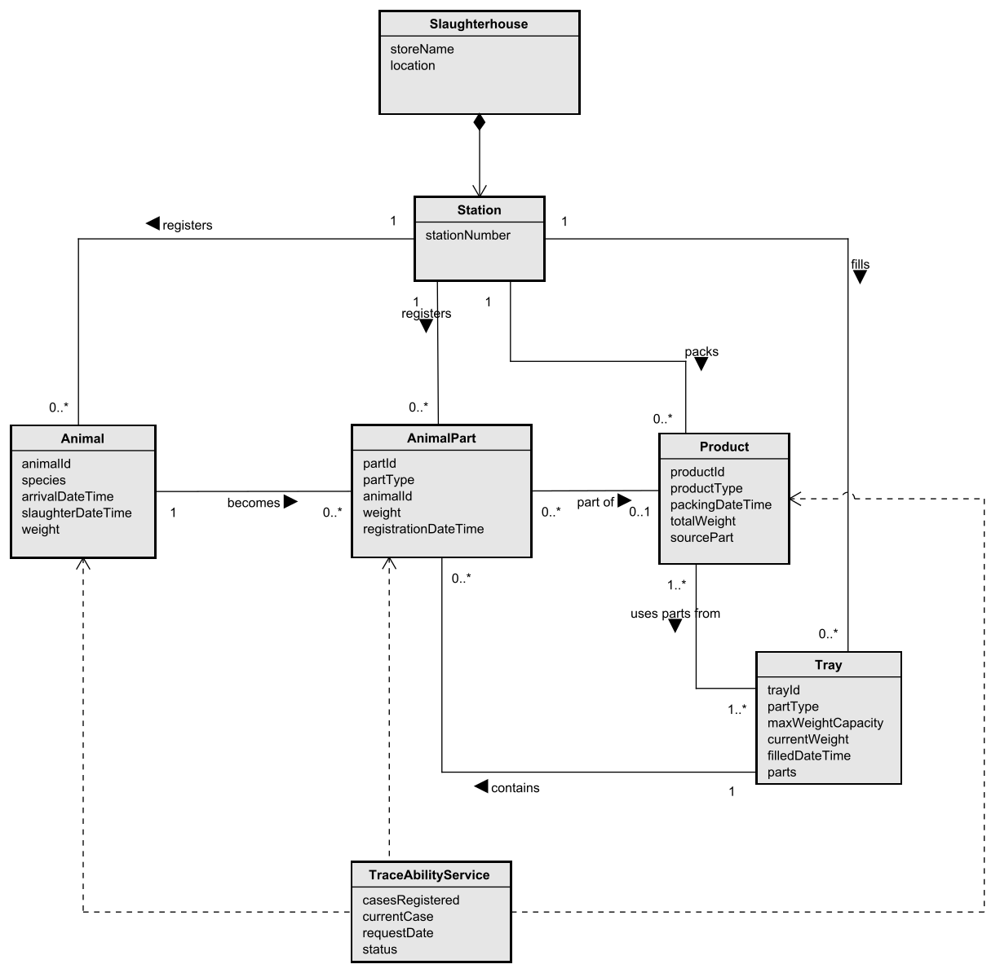
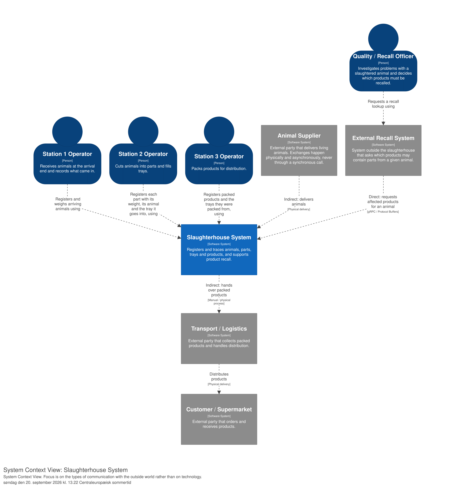
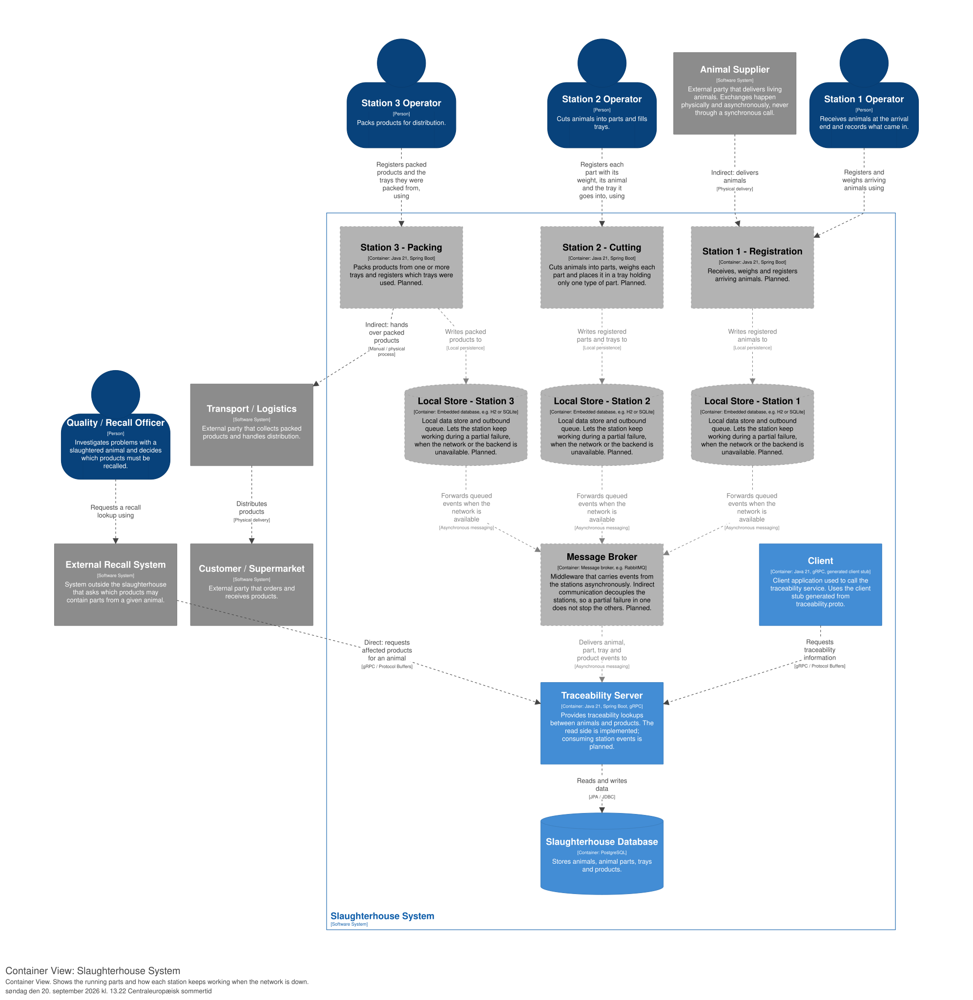
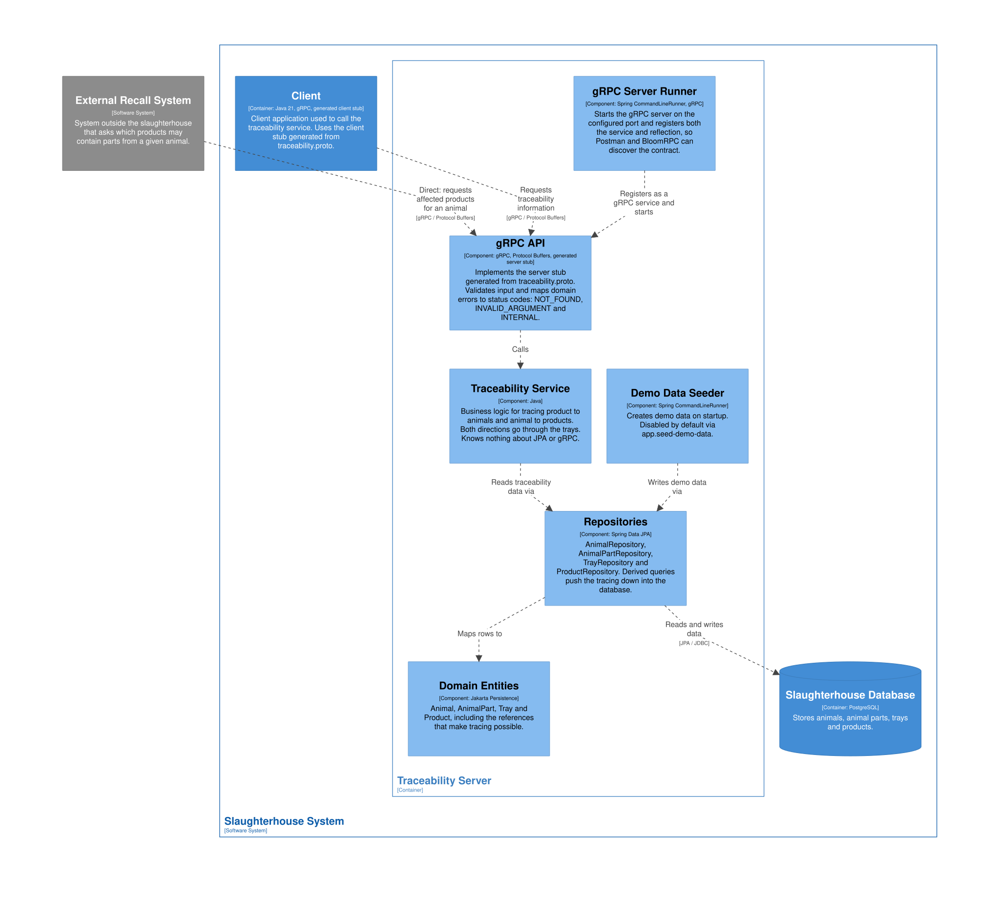

# DSY Course Assignment - SlaughterHouse
2026-09-20

## Projektets formål
Dette er et studieprojekt og projektet har dermed ikke til formål at bygge et produktionsklart slagterisystem, men at give den studerende (mig) praktisk erfaring med distribuerede systemer, som er et nyt fagområde dette semester.

Repository indeholder en simulering af et slagteri og er en del af kurset **'DSY - Distribuerede Systemer'**. Casen er et slagteri hvor levende dyr ankommer i den ene ende, og færdigpakkede produkter leveres i den anden ende. Undervejs passerer dyret tre stationer: registrering, opskæring i dele, og pakning af produkter.

Det centrale krav er **sporbarhed / tracking**. Hvis det senere viser sig at der er problemer med et slagtet dyr, skal alle produkter der kan indeholde dele fra dyret, kunne kaldes tilbage. Den funktion skal kunne tilgås udefra, og derfor er den eksponeret som en gRPC-service.

## Domænemodel
Domænemodellen viser de centrale begreber i slagteriet og relationerne mellem dem.



Sporingskæden er en vigtig del af modellen:

- Et `Animal` bliver skåret op i flere `AnimalPart`, og hver del husker hvilket dyr den kom fra.
- Hver `AnimalPart` lægges i en `Tray`. En bakke indeholder kun én type dele og har en maksimal vægtkapacitet.
- Et `Product` pakkes ud fra en eller flere `Tray`, og gemmer referencer tilbage til de bakker delene kom fra.

Et produkt peger på bakker, ikke på enkelte dele. Det matcher virkeligheden: når man pakker fra en bakke, ved man hvilke dyr der kan være i bakken, men ikke nødvendigvis hvilken del der er endt i hvilken pakke. Sporingen bliver derfor en bevidst overvurdering — den finder alle dyr der **kan** være i produktet.

## Arkitektur (C4-modellen)
Arkitekturen er modelleret i **Structurizr** med C4-modellens tre første niveauer. Kilden er én tekstfil, `docs/architecture/workspace.dsl`, som alle tre diagrammer genereres ud fra.

Diagrammerne er store. Klik på et diagram for at åbne det i fuld størrelse.

### C1 - System Context
Hvad bygger vi, hvem bruger det, hvad gør brugerne, og hvordan passer systemet ind i det eksisterende systemlandskab. Fokus er på **typerne af kommunikation** frem for på teknologi.

<a href="docs/diagrams/Structurizr-C1-SystemContext.svg" target="_blank" rel="noopener">
  
</a>

De blå figurer er systemets faktiske **brugere**: de tre stationsoperatører og en quality officer. De grå kasser er **eksterne systemer og parter** omkring systemet — de bruger ikke softwaren, men afgrænser processen.

- **Animal Supplier**, **Transport / Logistics** og **Customer / Supermarket** kommunikerer **indirekte**. De udveksler fysiske varer, og systemet må ikke gå i stå fordi en af dem er utilgængelig.
- **External Recall System** kommunikerer **direkte** over gRPC. Det er her sporbarhedsopslaget kaldes, og det er den del der er implementeret i dette projekt.

### C2 - Container View
Hvordan systemet er delt op i kørende enheder, og hvordan de taler sammen.

<a href="docs/diagrams/Structurizr-C2-Container.svg" target="_blank" rel="noopener">
  
</a>

Det stiplede er **planlagt**, ikke bygget. Opgavens krav om at en station skal kunne arbejde videre selvom netværket er nede, er det der former hele diagrammet: hver station skriver først til sit **eget lokale lager** og sender først videre gennem en **message broker** når netværket er der igen. Ingen station afhænger af at en anden station, brokeren eller serveren kan nås. Fejlen forbliver **partiel**.

### C3 - Component View
Traceability Server zoomet ind. Diagrammet afspejler den faktiske kode i `server`-modulet.

<a href="docs/diagrams/Structurizr-C3-Component.svg" target="_blank" rel="noopener">
  
</a>

Kontrakten bor i `traceability.proto`, og gRPC genererer en **client stub** og en **server stub** ud fra den. `gRPC API` implementerer server-stubben og oversætter domænefejl til statuskoder, mens `Traceability Service` holder selve sporingslogikken fri for både JPA og gRPC.

I Structurizr ligger der også dokumentation under `docs/architecture/docs/`, som besvarer C4-spørgsmålene og kobler arkitekturen til kursets begreber: partiel fejl, transparens, heterogenitet og åbenhed.

## Oversigt over systemets struktur
```
DSY-SlaughterHouse/
├── pom.xml                              (parent - styrer versioner for alle moduler)
├── docs/
│   └── diagrams/
│       ├── DSY-SlaughterHouse-DomainModel.svg
│       └── DSY-SlaughterHouse-C1-SystemContext.svg
├── proto/
│   ├── pom.xml
│   └── src/main/proto/
│       └── traceability.proto           (kontrakten - genererer Java-kode)
├── server/
│   ├── pom.xml
│   └── src/
│       ├── main/
│       │   ├── java/
│       │   │   ├── entity/              (Animal, AnimalPart, Tray, Product)
│       │   │   ├── repository/          (Spring Data JPA interfaces)
│       │   │   ├── service/             (TraceabilityService - sporingslogikken)
│       │   │   ├── grpc/                (gRPC-laget og serverens opstart)
│       │   │   └── server/              (Server, DemoDataSeeder)
│       │   └── resources/
│       │       └── application.properties
│       └── test/
│           ├── java/
│           │   ├── service/             (enhedstest + integrationstest)
│           │   └── grpc/                (test af gRPC-laget)
│           └── resources/
│               └── application.properties
└── client/
    ├── pom.xml
    └── src/main/java/com/example/
        └── Client.java                  (lille konsolklient til afprøvning)
```

Opdelingen i tre moduler er med vilje. `proto` indeholder kun kontrakten og kender hverken server eller klient. Både `server` og `client` afhænger af `proto`, men ikke af hinanden. Det gør det tydeligt at kontrakten er det eneste de to parter deler — hvilket er hele pointen i et distribueret system.

## Tracking 
Sporingen kan gå begge veje, og begge veje går gennem bakkerne.

**Fra produkt til dyr** — `getAnimalsForProduct`:

```
Product -> Tray(s) -> AnimalPart(s) -> Animal(s)
```

Bruges når man har et produkt og vil vide hvilke dyr der kan indgå i det.

**Fra dyr til produkt** — `getProductsForAnimal`:

```
Animal -> AnimalPart(s) -> Tray(s) -> Product(s)
```

Det er denne vej en tilbagekaldelse bruger: der er problemer med dyr nr. 1, hvilke produkter skal kaldes tilbage?

Logikken ligger i `TraceabilityService` og er bevidst holdt fri for både JPA-detaljer og gRPC. Servicen kender kun domænet, hvilket gør den nem at teste isoleret.

## gRPC-API
Kontrakten er defineret i `proto/src/main/proto/traceability.proto`:

```protobuf
service TraceabilityService {
  rpc GetAnimalsForProduct(GetAnimalsForProductRequest)
      returns (GetAnimalsForProductResponse);

  rpc GetProductsForAnimal(GetProductsForAnimalRequest)
      returns (GetProductsForAnimalResponse);
}
```

Maven genererer Java-klasser ud fra filen ved build, så både server og klient arbejder mod den samme kontrakt.

Fejl oversættes til gRPC-statuskoder i stedet for at boble op som tekniske exceptions:

| Situation | Statuskode |
| --- | --- |
| Opslaget lykkedes | `OK` |
| Ukendt `productId` eller `animalId` | `NOT_FOUND` |
| Tomt `productId`, eller `animalId` der ikke er positivt | `INVALID_ARGUMENT` |
| Uventet fejl, f.eks. databasen er nede | `INTERNAL` |

Et dyr der findes, men endnu ikke er pakket, er ikke en fejl. Det giver `OK` med en tom liste.

## Persistens
Data hentes fra en **PostgreSQL**-database via Spring Data JPA. De fire entities er `Animal`, `AnimalPart`, `Tray` og `Product`.

Selve opslagene bruger afledte queries, f.eks. `findByTrayIn(...)` og `findDistinctByTraysIn(...)`, så sporingen sker i databasen frem for i hukommelsen.

## Test
Projektet har 19 tests fordelt på tre klasser, som tester hvert sit niveau:

| Testklasse | Hvad den tester |
| --- | --- |
| `TraceabilityServiceTest` | Sporingslogikken isoleret. Repositories er Mockito-mocks, så der er hverken database eller netværk. |
| `TraceabilityServiceJpaTest` | Servicen mod en rigtig database (H2 i hukommelsen). Beviser at de afledte queries faktisk oversættes til SQL der virker. |
| `TraceabilityGrpcServiceTest` | gRPC-laget. Starter en rigtig gRPC-server "in-process" og kontrollerer at statuskoderne er rigtige. |

Testene er kommenteret på dansk, da de også fungerer som mine egne noter til hvad der bliver testet og hvorfor.


## Teknologier

- Java 21
- Maven multi-modul projekt
- gRPC og Protocol Buffers
- Spring Boot og Spring Data JPA
- PostgreSQL (H2 i tests)
- JUnit 5, Mockito og AssertJ
- Astah til domænemodel
- Structurizr (DSL) til C4-diagrammerne

## Status
Implementeret:

- Domænemodel
- C1, C2 og C3 modelleret i Structurizr
- gRPC-service med begge sporingsopslag
- Persistens i PostgreSQL via Spring Data JPA
- Eksplicit fejlhåndtering med gRPC-statuskoder
- 19 tests på tre niveauer
- Konsolklient til afprøvning
- gRPC reflection, så servicen kan testes med Postman og BloomRPC
- Demodata-seeder, der kan slås til og fra

Ikke implementeret endnu:

- De tre stationer som selvstændige, kørende enheder
- Offline-drift, hvor en station kan arbejde videre uden netværk og synkronisere bagefter
- Håndhævelse af bakkernes maksimale vægtkapacitet
- Autentificering og autorisation
