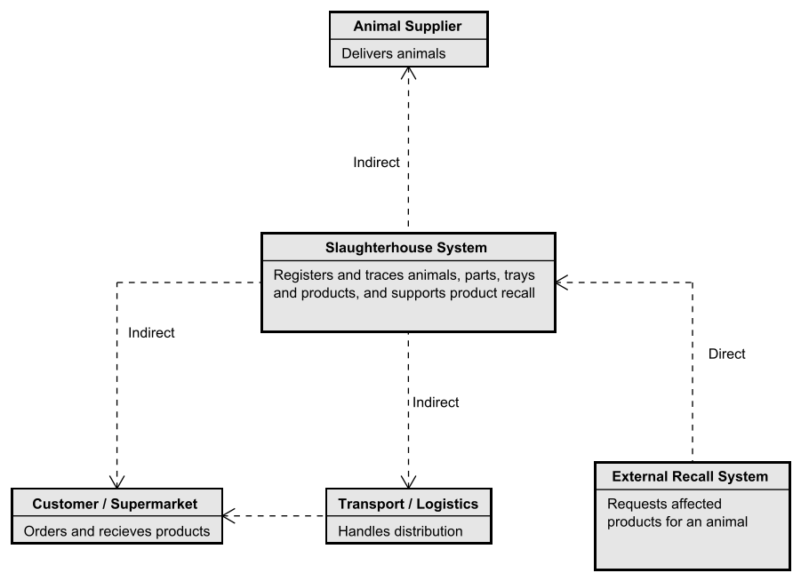

# DSY Course Assignment - SlaughterHouse
2026-09-20

Dette repository indeholder en simulering af et slagteri til kurset **DSY - Distribuerede Systemer**. Casen er et slagteri hvor levende dyr ankommer i den ene ende, og færdigpakkede produkter forlader den anden. Undervejs passerer dyret tre stationer: registrering, opskæring i dele, og pakning af produkter.

Det centrale krav er **sporbarhed**. Hvis det senere viser sig at der er problemer med et slagtet dyr, skal alle produkter der kan indeholde dele fra dyret, kunne kaldes tilbage. Den funktion skal kunne tilgås udefra, og derfor er den eksponeret som en gRPC-service.

I denne del af opgaven er fokus på selve opslagsservicen og dens persistens. De tre stationer er endnu ikke implementeret som selvstændige, kørende enheder.

## Domænemodel
Domænemodellen viser de centrale begreber i slagteriet og relationerne mellem dem.


Sporingskæden er den vigtige del af modellen:

- Et `Animal` bliver skåret op i flere `AnimalPart`, og hver del husker hvilket dyr den kom fra.
- Hver `AnimalPart` lægges i en `Tray`. En bakke indeholder kun én type dele og har en maksimal vægtkapacitet.
- Et `Product` pakkes ud fra en eller flere `Tray`, og gemmer referencer tilbage til de bakker delene kom fra.

Bemærk at et produkt peger på **bakker**, ikke på enkelte dele. Det er bevidst og matcher virkeligheden: når man pakker fra en bakke, ved man hvilke dyr der kan være i bakken, men ikke nødvendigvis præcis hvilken del der endte i hvilken pakke. Sporingen bliver derfor en bevidst overvurdering — den finder alle dyr der **kan** være i produktet. Det er netop det en tilbagekaldelse har brug for.

## Arkitekturoverblik (C1 - System Context)
C1-diagrammet viser systemet som én blok og fokuserer på **typerne af kommunikation** med omverdenen frem for på teknologi.



- **Animal Supplier**, **Transport / Logistics** og **Customer / Supermarket** kommunikerer **indirekte** med systemet. De udveksler fysiske varer og beskeder, og systemet må ikke gå i stå fordi en af dem er utilgængelig.
- **External Recall System** kommunikerer **direkte** med systemet. Det er her sporbarhedsopslaget bliver kaldt, og det er den del der er implementeret som gRPC-service i dette projekt.

Et gennemgående krav fra casen er at stationerne skal kunne arbejde så uafhængigt som muligt — arbejdet må ikke stoppe på en station bare fordi netværket er nede. Det er grunden til at kommunikationen udadtil er tegnet som overvejende indirekte.

## Projektets formål
Dette er et **studieprojekt**. Formålet er ikke at bygge et produktionsklart slagterisystem, men at give den studerende (mig) praktisk erfaring med distribuerede systemer, som er et nyt fagområde for mig på dette semester.

Konkret bruger jeg projektet til at lære:

- Hvordan services kommunikerer med hinanden gennem **gRPC** og **Protocol Buffers**, og hvordan en kontrakt defineres i en `.proto`-fil frem for i kode.
- Forskellen på **direkte og indirekte kommunikation**, og hvorfor valget har betydning når dele af systemet kan være utilgængelige.
- Hvordan man beskriver arkitektur med **C4-modellen** i stedet for kun at tegne klassediagrammer.
- Hvordan et lagdelt design med entities, repositories og service holder sporingslogikken adskilt fra både databasen og protokollen.

Derudover bruger jeg projektet til at forbedre mine generelle programmeringsevner: at strukturere et Maven multi-modul-projekt, at skrive tests der rent faktisk siger noget, og at gøre fejlhåndtering eksplicit frem for tilfældig.

Koden er derfor skrevet med læring for øje. Nogle valg er bevidst simple, og nogle dele er endnu ikke implementeret — det fremgår af afsnittet **Status** nederst.

## Løsningsstruktur
```
DSY-SlaughterHouse/
├── pom.xml                              (parent - styrer versioner for alle moduler)
├── docs/
│   └── diagrams/
│       ├── DSY-SlaughterHouse-DomainModel.svg
│       └── DSY-SlaughterHouse-C1-SystemContext.svg
├── proto/
│   ├── pom.xml
│   └── src/main/proto/
│       └── traceability.proto           (kontrakten - genererer Java-kode)
├── server/
│   ├── pom.xml
│   └── src/
│       ├── main/
│       │   ├── java/
│       │   │   ├── entity/              (Animal, AnimalPart, Tray, Product)
│       │   │   ├── repository/          (Spring Data JPA interfaces)
│       │   │   ├── service/             (TraceabilityService - sporingslogikken)
│       │   │   ├── grpc/                (gRPC-laget og serverens opstart)
│       │   │   └── server/              (Server, DemoDataSeeder)
│       │   └── resources/
│       │       └── application.properties
│       └── test/
│           ├── java/
│           │   ├── service/             (enhedstest + integrationstest)
│           │   └── grpc/                (test af gRPC-laget)
│           └── resources/
│               └── application.properties
└── client/
    ├── pom.xml
    └── src/main/java/com/example/
        └── Client.java                  (lille konsolklient til afprøvning)
```

Opdelingen i tre moduler er med vilje. `proto` indeholder kun kontrakten og kender hverken server eller klient. Både `server` og `client` afhænger af `proto`, men ikke af hinanden. Det gør det tydeligt at kontrakten er det eneste de to parter deler — hvilket er hele pointen i et distribueret system.

## Sporbarhed
Sporingen kan gå begge veje, og begge veje går gennem bakkerne.

**Fra produkt til dyr** — `getAnimalsForProduct`:

```
Product -> Tray(s) -> AnimalPart(s) -> Animal(s)
```

Bruges når man har et produkt og vil vide hvilke dyr der kan indgå i det.

**Fra dyr til produkt** — `getProductsForAnimal`:

```
Animal -> AnimalPart(s) -> Tray(s) -> Product(s)
```

Det er denne vej en tilbagekaldelse bruger: der er problemer med dyr nr. 1, hvilke produkter skal kaldes tilbage?

Logikken ligger i `TraceabilityService` og er bevidst holdt fri for både JPA-detaljer og gRPC. Servicen kender kun domænet, hvilket gør den nem at teste isoleret.

## gRPC-API
Kontrakten er defineret i `proto/src/main/proto/traceability.proto`:

```protobuf
service TraceabilityService {
  rpc GetAnimalsForProduct(GetAnimalsForProductRequest)
      returns (GetAnimalsForProductResponse);

  rpc GetProductsForAnimal(GetProductsForAnimalRequest)
      returns (GetProductsForAnimalResponse);
}
```

Maven genererer Java-klasser ud fra filen ved build, så både server og klient arbejder mod den samme kontrakt.

Fejl oversættes til gRPC-statuskoder i stedet for at boble op som tekniske exceptions:

| Situation | Statuskode |
| --- | --- |
| Opslaget lykkedes | `OK` |
| Ukendt `productId` eller `animalId` | `NOT_FOUND` |
| Tomt `productId`, eller `animalId` der ikke er positivt | `INVALID_ARGUMENT` |
| Uventet fejl, f.eks. databasen er nede | `INTERNAL` |

Et dyr der findes, men endnu ikke er pakket, er ikke en fejl. Det giver `OK` med en tom liste.

## Persistens
Data hentes fra en **PostgreSQL**-database via Spring Data JPA. De fire entities er `Animal`, `AnimalPart`, `Tray` og `Product`.

Selve opslagene bruger afledte queries, f.eks. `findByTrayIn(...)` og `findDistinctByTraysIn(...)`, så sporingen sker i databasen frem for i hukommelsen.

## Test
Projektet har 19 tests fordelt på tre klasser, som tester hvert sit niveau:

| Testklasse | Hvad den tester |
| --- | --- |
| `TraceabilityServiceTest` | Sporingslogikken isoleret. Repositories er Mockito-mocks, så der er hverken database eller netværk. |
| `TraceabilityServiceJpaTest` | Servicen mod en rigtig database (H2 i hukommelsen). Beviser at de afledte queries faktisk oversættes til SQL der virker. |
| `TraceabilityGrpcServiceTest` | gRPC-laget. Starter en rigtig gRPC-server "in-process" og kontrollerer at statuskoderne er rigtige. |

Testene er kommenteret på dansk, da de også fungerer som mine egne noter til hvad der bliver testet og hvorfor.

Kør dem med:

```bash
mvn test
```

## Kom i gang

### 1. Opsæt databasekonfiguration
`server/src/main/resources/application.properties` er med vilje ikke i versionsstyring, da den peger på en lokal database. Opret den med:

```properties
spring.datasource.url=${DB_URL:jdbc:postgresql://localhost:5432/slaughterhouse}
spring.datasource.username=${DB_USERNAME:postgres}
spring.datasource.password=${DB_PASSWORD}

spring.jpa.hibernate.ddl-auto=update
spring.jpa.show-sql=true

grpc.server.port=${GRPC_PORT:9090}

app.seed-demo-data=false
```

Kodeordet læses fra miljøvariablen `DB_PASSWORD` og står derfor ikke i filen. Sæt den i din run configuration, eller i terminalen inden du starter serveren.

### 2. Byg projektet
```bash
mvn clean install
```

### 3. Start serveren
```bash
mvn -pl server spring-boot:run
```

Serveren lytter på port 9090. Vil du have testdata i databasen fra start, sættes `app.seed-demo-data=true`. Seederen opretter tre grise, tre bakker og to produkter, og springer over hvis der allerede er data.

### 4. Afprøv servicen
Med den medfølgende klient:

```bash
mvn -pl client exec:java -Dexec.mainClass=com.example.Client -Dexec.args="PROD-LOIN-PACK 1"
```

Serveren eksponerer også gRPC reflection, så **Postman** og **BloomRPC** selv kan finde servicen uden at man importerer `.proto`-filen manuelt.

## Teknologier

- Java 21
- Maven multi-modul projekt
- gRPC og Protocol Buffers
- Spring Boot og Spring Data JPA
- PostgreSQL (H2 i tests)
- JUnit 5, Mockito og AssertJ
- Astah til domænemodel og C4-diagrammer

## Status
Implementeret:

- Domænemodel
- C1 - System Context View
- gRPC-service med begge sporingsopslag
- Persistens i PostgreSQL via Spring Data JPA
- Eksplicit fejlhåndtering med gRPC-statuskoder
- 19 tests på tre niveauer
- Konsolklient til afprøvning
- gRPC reflection, så servicen kan testes med Postman og BloomRPC
- Demodata-seeder, der kan slås til og fra

Ikke implementeret endnu:

- C2 - Container View og C3 - Component View
- De tre stationer som selvstændige, kørende enheder
- Offline-drift, hvor en station kan arbejde videre uden netværk og synkronisere bagefter
- Håndhævelse af bakkernes maksimale vægtkapacitet
- Autentificering og autorisation
