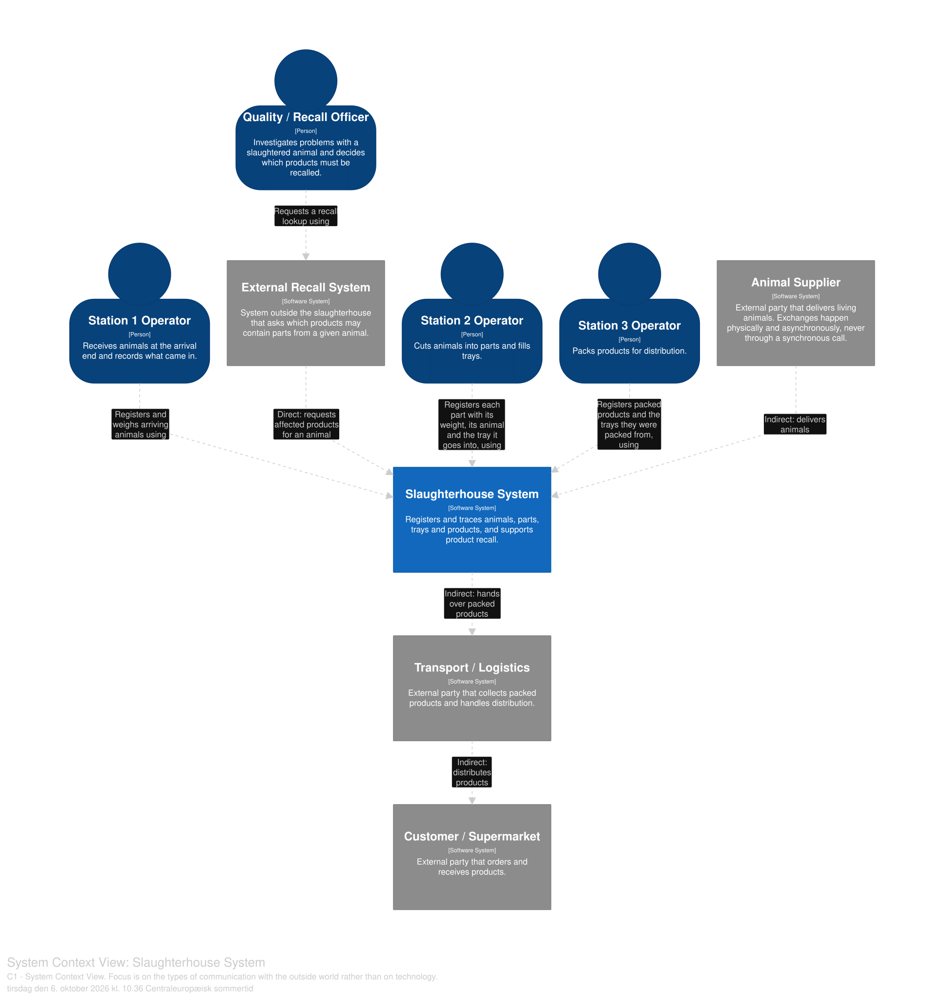
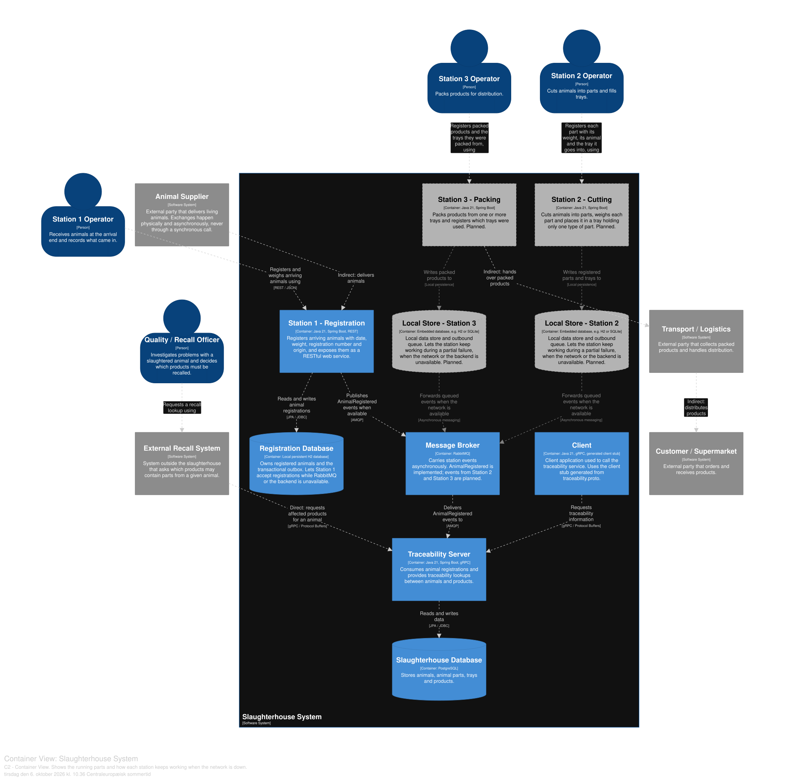
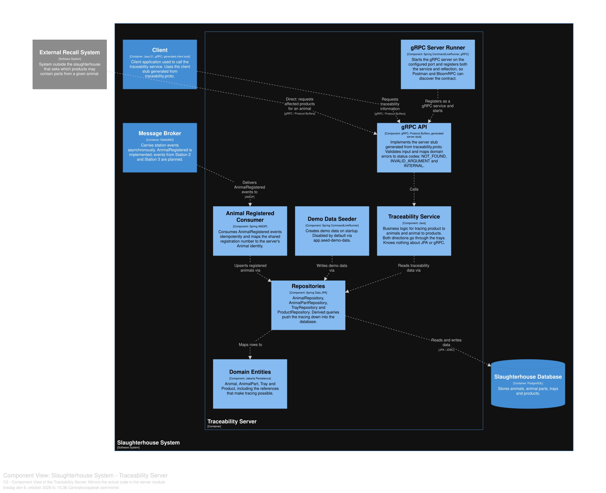
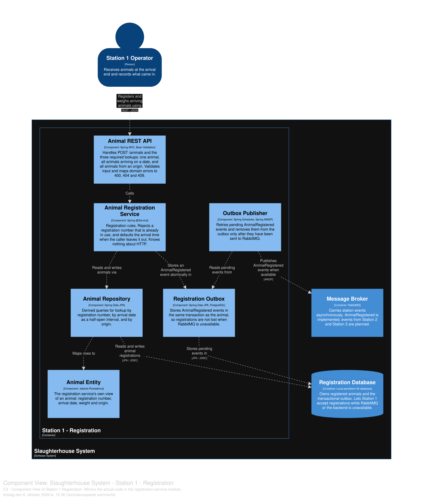

# DSY Course Assignment - SlaughterHouse
2026-09-20

## Projektets formål
Dette er et studieprojekt og projektet har dermed ikke til formål at bygge et produktionsklart slagterisystem, men at give den studerende (mig) praktisk erfaring med distribuerede systemer, som er et nyt fagområde dette semester.

Repository indeholder en simulering af et slagteri og er en del af kurset **'DSY - Distribuerede Systemer'**. Casen er et slagteri hvor levende dyr ankommer i den ene ende, og færdigpakkede produkter leveres i den anden ende. Undervejs passerer dyret tre stationer: registrering, opskæring i dele, og pakning af produkter.

Det centrale krav er **sporbarhed / tracking**. Hvis det senere viser sig at der er problemer med et slagtet dyr, skal alle produkter der kan indeholde dele fra dyret, kunne kaldes tilbage. Den funktion skal kunne tilgås udefra, og derfor er den eksponeret som en gRPC-service.

## Domænemodel
Domænemodellen viser de centrale begreber i slagteriet og relationerne mellem dem.


Sporingskæden er en vigtig del af modellen:

- Et `Animal` bliver skåret op i flere `AnimalPart`, og hver del husker hvilket dyr den kom fra.
- Hver `AnimalPart` lægges i en `Tray`. En bakke indeholder kun én type dele og har en maksimal vægtkapacitet.
- Et `Product` pakkes ud fra en eller flere `Tray`, og gemmer referencer tilbage til de bakker delene kom fra.

Et produkt peger på bakker, ikke på enkelte dele. Det matcher virkeligheden: når man pakker fra en bakke, ved man hvilke dyr der kan være i bakken, men ikke nødvendigvis hvilken del der er endt i hvilken pakke. Sporingen bliver derfor en bevidst overvurdering — den finder alle dyr der **kan** være i produktet.

## Arkitektur (C4-modellen)
Arkitekturen er modelleret i **Structurizr** med C4-modellens tre første niveauer. Kilden er én tekstfil, `docs/architecture/workspace.dsl`, som alle tre diagrammer genereres ud fra.

Diagrammerne er store. Klik på et diagram for at åbne det i fuld størrelse.

### C1 - System Context
Hvad bygger vi, hvem bruger det, hvad gør brugerne, og hvordan passer systemet ind i det eksisterende systemlandskab. Fokus er på **typerne af kommunikation** frem for på teknologi.

<a href="docs/diagrams/C1-SystemContext.svg" target="_blank" rel="noopener">
  
</a>

De blå figurer er systemets faktiske **brugere**: de tre stationsoperatører og en quality officer. De grå kasser er **eksterne systemer og parter** omkring systemet — de bruger ikke softwaren, men afgrænser processen.

- **Animal Supplier**, **Transport / Logistics** og **Customer / Supermarket** kommunikerer **indirekte**. De udveksler fysiske varer, og systemet må ikke gå i stå fordi en af dem er utilgængelig.
- **External Recall System** kommunikerer **direkte** over gRPC. Det er her sporbarhedsopslaget kaldes, og det er den del der er implementeret i dette projekt.

### C2 - Container View
Hvordan systemet er delt op i kørende enheder, og hvordan de taler sammen.

<a href="docs/diagrams/C2-Container.svg" target="_blank" rel="noopener">
  
</a>

Det stiplede er **planlagt**, ikke bygget. Station 1, dens database, RabbitMQ og serverens `AnimalRegistered`-consumer er implementeret. Station 2 og Station 3 er stadig planlagte. Station 1 gemmer både dyret og en event i en transactional outbox, så registreringen kan gennemføres, selvom RabbitMQ eller serveren er nede. Eventen sendes automatisk, når forbindelsen er tilbage.

### C3 - Component View: Traceability Server
Serveren zoomet ind. Diagrammet afspejler den faktiske kode i `server`-modulet.

<a href="docs/diagrams/C3-Component-Traceability.svg" target="_blank" rel="noopener">
  
</a>

Kontrakten bor i `traceability.proto`, og gRPC genererer en **client stub** og en **server stub** ud fra den. `gRPC API` implementerer server-stubben og oversætter domænefejl til statuskoder, mens `Traceability Service` holder sporingslogikken fri for både JPA og gRPC. `Animal Registered Consumer` modtager events fra RabbitMQ og bruger registreringsnummeret som den fælles identitet på tværs af de to databaser.

### C3 - Component View: Station 1 (Registration)
Registration-servicen zoomet ind. Afspejler koden i `registration-service`-modulet.

<a href="docs/diagrams/C3-Component-Registration.svg" target="_blank" rel="noopener">
  
</a>

`Animal REST API` validerer input, `REST Exception Handler` oversætter domænefejl til 404, 409 og 400, og `Registration Outbox` gemmer eventen i samme transaktion som dyret. `Outbox Publisher` sender den videre, når RabbitMQ er tilgængelig.

I Structurizr ligger der også dokumentation under `docs/architecture/docs/`, som besvarer C4-spørgsmålene og kobler arkitekturen til kursets begreber: partiel fejl, transparens, heterogenitet og åbenhed.

## Lokal infrastruktur

Traceability-serveren bruger PostgreSQL, mens Station 1 bruger sin egen lokale H2-fildatabase. De deler altså ikke database — compose starter kun Postgres til traceability.

Kodeordet til Postgres ligger i en `.env`-fil, som ikke er i versionsstyring. Kopier `.env.example` til `.env` og udfyld den første gang. Derefter:

```powershell
docker compose up -d
```

- Traceability-serveren bruger PostgreSQL-databasen `slaughterhouse`.
- Registration-service opretter automatisk sin lokale database under `registration-service/data/`.
- RabbitMQ bruger port `5672`; administrationssiden ligger på `http://localhost:15672` med `guest` / `guest`.

Start derefter `Server` og `RegistrationServiceApplication`. En `POST /animals` bliver først gemt i registration-servicens database. `AnimalRegisteredEvent` sendes derefter via RabbitMQ og gemmes idempotent i traceability-serverens database med samme registreringsnummer.

## Oversigt over systemets struktur
```
DSY-SlaughterHouse/
├── pom.xml                 parent, styrer versioner for alle moduler
├── compose.yaml            PostgreSQL + RabbitMQ
├── proto/                  gRPC-kontrakten
├── shared/                 DTO'er og messaging-kontrakt mellem de to services
├── server/                 Traceability: gRPC, PostgreSQL, event-consumer
├── registration-service/   Station 1: REST, egen H2-database, outbox
├── client/                 konsolklient til gRPC
└── docs/
    ├── architecture/       Structurizr workspace
    └── diagrams/           eksporterede diagrammer
```

`proto` og `shared` indeholder kun kontrakter. `server` og `registration-service` afhænger af dem, men ikke af hinanden — de taler sammen over RabbitMQ. Det er hele pointen: kontrakten er det eneste de deler.

## gRPC-API
Kontrakten er defineret i `proto/src/main/proto/traceability.proto`:

```protobuf
service TraceabilityService {
  rpc GetAnimalsForProduct(GetAnimalsForProductRequest)
      returns (GetAnimalsForProductResponse);

  rpc GetProductsForAnimal(GetProductsForAnimalRequest)
      returns (GetProductsForAnimalResponse);
}
```

Fejl oversættes til gRPC-statuskoder i stedet for at boble op som tekniske exceptions:

| Situation | Statuskode |
| --- | --- |
| Opslaget lykkedes | `OK` |
| Ukendt `productId` eller `animalId` | `NOT_FOUND` |
| Tomt `productId`, eller `animalId` der ikke er positivt | `INVALID_ARGUMENT` |
| Uventet fejl, f.eks. databasen er nede | `INTERNAL` |

Et dyr der findes, men endnu ikke er pakket, er ikke en fejl. Det giver `OK` med en tom liste.

## Persistens

De to services har hver sin database. Traceability-serveren bruger PostgreSQL; registration-servicen bruger sin egen H2-fil under `registration-service/data/`. De deler ikke skema, men holdes i sync gennem RabbitMQ.

Systemet er derfor eventually consistent: et nyregistreret dyr er kendt i traceability-databasen inden for få sekunder, ikke med det samme. For sporbarhed er det acceptabelt, fordi opslaget alligevel er en bevidst overvurdering.

Opslagene bruger afledte queries, fx `findByTrayIn(...)` og `findByOriginIgnoreCase(...)`, så filtreringen sker i databasen frem for i hukommelsen.

## Test

Projektet har 43 tests, delt op efter lag: forretningslogikken isoleret med mocks, servicerne mod en database i hukommelsen, og yderlagene hver for sig — gRPC in-process, REST med MockMvc, og messaging med mocks.

Testene er kommenteret på dansk, da de også fungerer som mine egne noter til hvad der testes og hvorfor.

## Teknologier

- Java 21
- Maven multi-modul projekt
- gRPC og Protocol Buffers
- Spring Boot og Spring Data JPA
- PostgreSQL og H2
- RabbitMQ via Spring AMQP
- JUnit 5, Mockito og AssertJ
- Astah til domænemodel
- Structurizr (DSL) til C4-diagrammerne

## Status
Implementeret:

- Domænemodel
- C1, C2 og C3 modelleret i Structurizr
- gRPC-service med begge sporingsopslag
- Persistens i PostgreSQL via Spring Data JPA
- Eksplicit fejlhåndtering med gRPC-statuskoder
- 43 tests fordelt på lagene
- Konsolklient til afprøvning
- gRPC reflection, så servicen kan testes med Postman og BloomRPC
- Demodata-seeder, der kan slås til og fra
- Station 1 som selvstændig REST-service med egen database
- Transactional outbox, så en registrering overlever at RabbitMQ er nede
- Dead-letter-kø, så en ugyldig besked parkeres i stedet for at blokere

Ikke implementeret endnu:

- Station 2 og Station 3 som kørende enheder
- Håndhævelse af bakkernes maksimale vægtkapacitet
- Autentificering og autorisation
